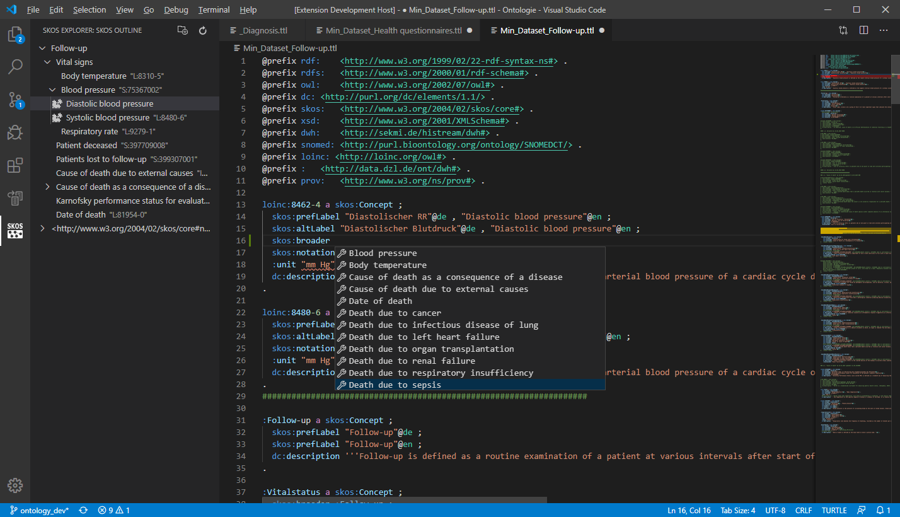

# skos-ttl-editor
An extension for Visual Studio Code for simplified editing of SKOS Turtle (.ttl) files.

   

### Features

- Tree view for SKOS datasets, considering schemes, collections and all SKOS hierarchical relations like broader, narrower, inScheme and member
- Go to implementation for IRIs
- Go to references for IRIs
- Hover information for IRIs
- Autocompletion for SKOS
- Semantic checks, e.g. unique prefLabel and unambiguous type definition (Concept, ConceptScheme and Collection)
- Load whole workspace directory for SKOS resource completion
- Customizable hierarchical relations, tree view icons and auto completion terms

### Recommendation
Also have a look at extensions by Stardog (RDF Languages Extension Pack).